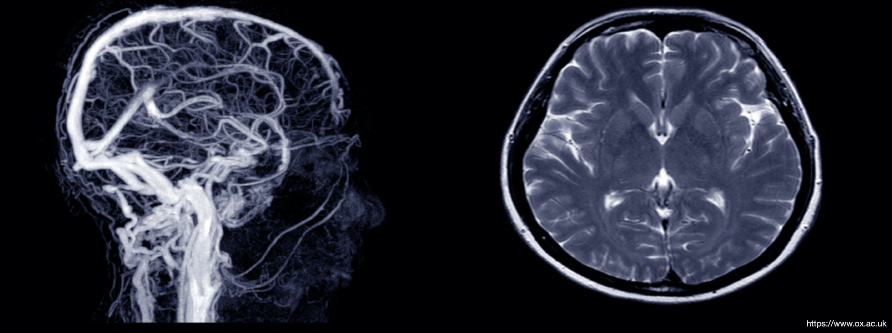

# AI decision support for medical triage
## Predicting short and long term outcomes of stroke patients

 

This is the final project at the Data Science Bootcamp [@neuefische](https://www.neuefische.de/en/weiterbildung/data-science) and has been developed in 4 weeks in the spring of 2021 (by myself).

## Overview

The [International Stroke Trial]() was a randomized, open trial of up to 14 days of antithrombotic therapy started as soon as possible after stroke onset. The aim was to provide reliable evidence on the safety and efficacy of aspirin and of subcutaneous heparin. The dataset was downloaded from here. 
In this project we did not analyse the effect of the treatment participants received during the trail, but used the collected data to train models to predict a negative outcome for the patients (see below). 

We focussed on the investigation whether this data can be implemented to build a decision support tool for medical staff. A ranking process (triage) allows hospitals to prioritize patients based on severity of illness or injury, with the intent of treating the sickest first.

## Goal: Short and long term prediction of stroke patients

The aim of this project was to analyse the data of the International Stroke Trial and its implementation for decision support tools for medical triage. In detail, the objectives were:

+ Build a model that predicts the negative short term outcome, i.e. death after 14 days, of stroke patients.
+ Build a model that predicts the negative long term outcome, i.e. poor health condition or death after six months, of stroke patients.

The prediction of a negative outcome may help medical staff to sort patients into severe and less severe groups and thereby provide the particular care needed.

## Repo Organization

+ [01_IST_clean_feat_eng.ipynb](https://github.com/EnHaHB/Stroke-Outcome/blob/main/01_IST_clean_feat_eng.ipynb): Data cleaning of the original data set. 
+ [02_IST_EDA.ipynb](https://github.com/EnHaHB/Stroke-Outcome/blob/main/02_IST_EDA.ipynb): Exploratory Data Analysis of the data. Includes an introduction on the topic.
+ [03_IST_basic_stats.ipynb](https://github.com/EnHaHB/Stroke-Outcome/blob/main/03_IST_basic_stats.ipynb): Basic simple statistical analyses of the treatment effect participants received during the International Stroke Trial.
+ [04_IST_model_shortterm.ipynb](https://github.com/EnHaHB/Stroke-Outcome/blob/main/04_IST_model_shortterm.ipynb): Analyses and training of various machine learning models to predict the short term outcome of stroke patients.
+ [05_IST_model_longterm.ipynb](https://github.com/EnHaHB/Stroke-Outcome/blob/main/05_IST_model_longterm.ipynb): Analyses and training of various machine learning models to predict the long term outcome of stroke patients.
+ [06_IST_results.ipynb](https://github.com/EnHaHB/Stroke-Outcome/blob/main/06_IST_results.ipynb): Summary of the results, including limitations and thoughts on futur work.
+ [IST_corrected_columns](https://github.com/EnHaHB/Stroke-Outcome/blob/main/IST_corrected_columns.ipynb): Information on each original feature in the dataset
+ [IST_presentation](https://github.com/EnHaHB/Stroke-Outcome/blob/main/IST_presentation.pdf): Short presentation of the project

## Outcome and conclusions
Logistic Regression was the best model to predict the short term outcome of stroke patients (recall = 73%), with a fairly reasonable accuracy (70%). For the prediction of the long term of stroke patients, Random Forest was the best model (recall = 89%, accuracy = 76%). Below we have summarized these two models again.

Both models were primarily driven by the age of the participants. In both models, dysphasia, hemianopia, visuospatial disorder, systolic blood pressure had an effect, but to different degrees.

Once more detailed data has been added to the models, these may be implemented as a decision support tool for medical teams.

## Future work

+ Additional Features:
    + Smoking,  alcoholism, birth control medicine, obesity, genetic  preposition, ethnicity
    + Treatment/medication of the patients
+ Application in hospitals:
    + What is needed?
    + Ethical considerations!
+ Modeling:
    + Other techniques (neuronal networks)
